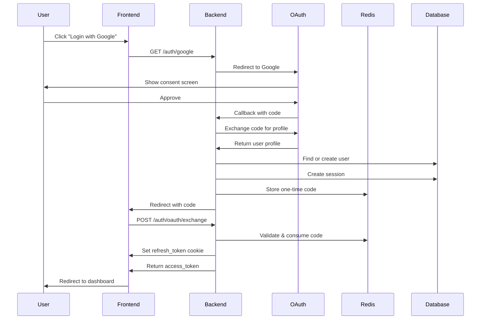
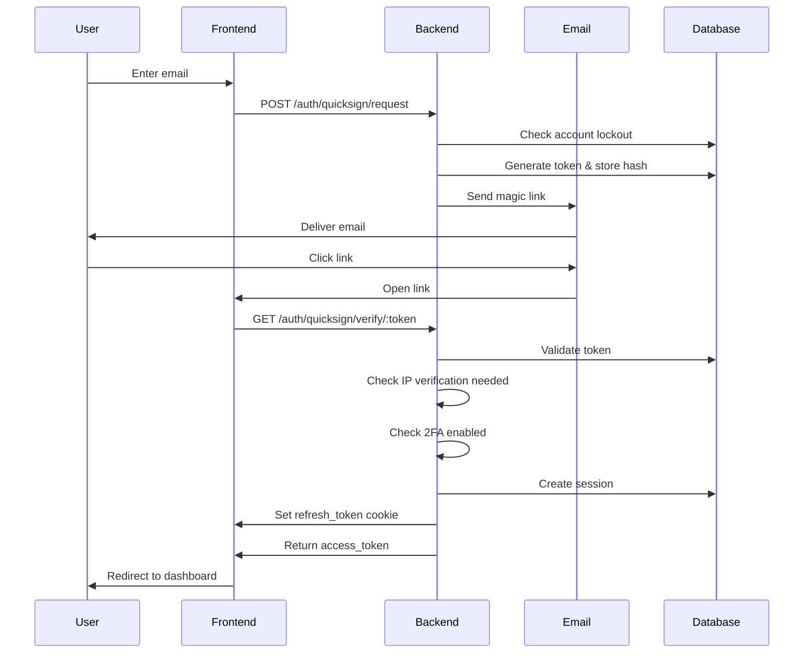
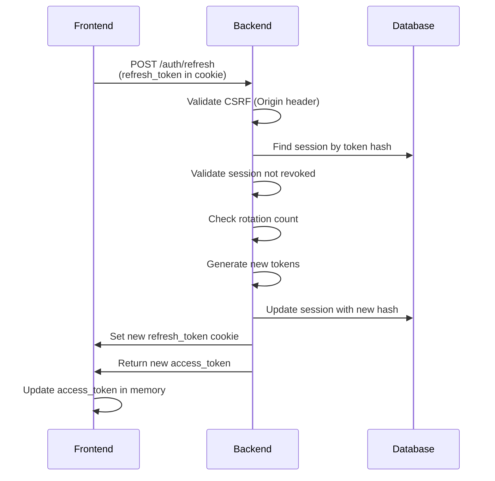

# Login & Authentication System - Comprehensive Review

**Project:** Rukny.io  
**Date:** January 15, 2026  
**Version:** 2.1  
**Review Type:** Complete System Architecture & Implementation Analysis

---

## 📋 Table of Contents

1. [Executive Summary](#executive-summary)
2. [Authentication Methods](#authentication-methods)
3. [Security Architecture](#security-architecture)
4. [Token Management System](#token-management-system)
5. [Login Flow Diagrams](#login-flow-diagrams)
6. [Session Management](#session-management)
7. [Security Features](#security-features)
8. [Database Schema](#database-schema)
9. [API Endpoints](#api-endpoints)
10. [Frontend Integration](#frontend-integration)
11. [Security Vulnerabilities & Mitigations](#security-vulnerabilities--mitigations)
12. [Performance Optimizations](#performance-optimizations)
13. [Monitoring & Logging](#monitoring--logging)
14. [Recommendations](#recommendations)

---

## Executive Summary

### System Overview

Rukny.io implements a **sophisticated multi-factor authentication system** with:
- ✅ OAuth 2.0 (Google, LinkedIn)
- ✅ QuickSign (Passwordless Email Links)
- ✅ Two-Factor Authentication (2FA)
- ✅ Session Management with Token Rotation
- ✅ Account Lockout Protection
- ✅ IP Verification
- ✅ Real-time Security Monitoring

### Key Security Features

🔒 **Token Architecture:**
- Access Token: 15 minutes (JWT, stateless)
- Refresh Token: 14 days (httpOnly cookie, stored hash)
- Token rotation on every refresh
- Session-based revocation (via `sid` in JWT)

🔒 **Protection Mechanisms:**
- Brute force protection (account lockout after 5 attempts)
- Progressive lockout duration (exponential backoff)
- IP verification for new devices
- CSRF protection (SameSite=Lax + Origin validation)
- XSS protection (httpOnly cookies)
- Rate limiting on all auth endpoints

🔒 **Advanced Features:**
- Real-time security notifications (WebSocket)
- Email alerts for suspicious activity
- Telegram notifications for important events
- Comprehensive security logging
- Device fingerprinting

---

## Authentication Methods

### 1. OAuth 2.0 Authentication

#### Supported Providers
- **Google OAuth:** Full implementation with profile data
- **LinkedIn OAuth:** Full implementation with profile data

#### Flow Architecture

```
┌─────────────┐                                    ┌─────────────┐
│   Browser   │                                    │  OAuth      │
│  (Frontend) │                                    │  Provider   │
└──────┬──────┘                                    └──────┬──────┘
       │                                                  │
       │  1. GET /auth/google                            │
       ├────────────────────────────────────────────────►│
       │                                                  │
       │  2. Redirect to Google Login                    │
       │◄────────────────────────────────────────────────┤
       │                                                  │
       │  3. User approves                               │
       ├────────────────────────────────────────────────►│
       │                                                  │
       │  4. Callback with code                          │
       │◄────────────────────────────────────────────────┤
       │                                                  │
       ↓                                                  │
┌─────────────────────────────────────────────────┐     │
│         NestJS Backend (Port 3001)              │     │
│                                                 │     │
│  5. GET /auth/google/callback                   │     │
│     ┌──────────────────────────────────┐       │     │
│     │ GoogleStrategy validates user    │       │     │
│     │ - Check email_verified from      │       │     │
│     │   Google                         │       │     │
│     │ - Find or create user            │       │     │
│     │ - Link Google ID to account      │       │     │
│     └──────────────────────────────────┘       │     │
│                                                 │     │
│  6. Create Session                              │     │
│     ┌──────────────────────────────────┐       │     │
│     │ - Generate Session ID (sid)      │       │     │
│     │ - Generate Access Token (15m)    │       │     │
│     │ - Generate Refresh Token (14d)   │       │     │
│     │ - Store session in DB            │       │     │
│     │ - Hash refresh token             │       │     │
│     └──────────────────────────────────┘       │     │
│                                                 │     │
│  7. Generate One-Time OAuth Code                │     │
│     ┌──────────────────────────────────┐       │     │
│     │ Redis-stored code (5 min TTL)    │       │     │
│     │ Contains:                         │       │     │
│     │ - access_token                    │       │     │
│     │ - refresh_token                   │       │     │
│     │ - user data                       │       │     │
│     └──────────────────────────────────┘       │     │
│                                                 │     │
│  8. Redirect to Frontend                        │     │
│     with code parameter                         │     │
└─────────────────────────────────────────────────┘     │
       │                                                 │
       │  9. Frontend receives redirect                  │
       │     http://localhost:3000/auth/callback?code=... │
       ↓                                                 │
┌─────────────────────────────────────────────────┐     │
│         Frontend (Port 3000)                    │     │
│                                                 │     │
│  10. POST /auth/oauth/exchange                  │     │
│      { code: "..." }                            │     │
│                                                 │     │
└─────────────────────────────────────────────────┘     │
       │                                                 │
       ↓                                                 │
┌─────────────────────────────────────────────────┐     │
│         Backend validates code                  │     │
│                                                 │     │
│  11. Validate one-time code                     │     │
│      ┌──────────────────────────────────┐      │     │
│      │ - Check Redis for code           │      │     │
│      │ - Verify not expired (5 min)     │      │     │
│      │ - Delete code (one-time use)     │      │     │
│      └──────────────────────────────────┘      │     │
│                                                 │     │
│  12. Set Cookies & Return Token                 │     │
│      ┌──────────────────────────────────┐      │     │
│      │ Response:                         │      │     │
│      │ - Set-Cookie: refresh_token      │      │     │
│      │   (httpOnly, secure, SameSite)   │      │     │
│      │ Body:                             │      │     │
│      │ - access_token (for memory)      │      │     │
│      │ - user data                       │      │     │
│      └──────────────────────────────────┘      │     │
└─────────────────────────────────────────────────┘     │
       │                                                 │
       │  13. Store access_token in memory               │
       │      (React state/context)                      │
       │                                                 │
       │  14. User authenticated & redirected            │
       ↓                                                 │
   Dashboard                                             │
```

#### Implementation Details

**Backend: Google Strategy**
```typescript
// apps/api/src/domain/auth/strategies/google.strategy.ts

@Injectable()
export class GoogleStrategy extends PassportStrategy(Strategy, 'google') {
  async validate(accessToken, refreshToken, profile, done) {
    // ✅ Verify email_verified from Google
    // ✅ Find or create user
    // ✅ Link Google ID to account
    // ✅ Return user object
  }
}
```

**Backend: OAuth Callback Handler**
```typescript
// apps/api/src/domain/auth/auth.controller.ts

@Get('google/callback')
@UseGuards(GoogleAuthGuard)
async googleAuthCallback(@Req() req, @Res() res) {
  // 1. Get user from GoogleStrategy
  const result = await this.authService.googleLogin(req.user, userAgent, ipAddress);
  
  // 2. Generate one-time code (Redis, 5 min TTL)
  const code = await this.oauthCodeService.generate({
    access_token: result.access_token,
    refresh_token: result.refresh_token,
    user: result.user,
  });
  
  // 3. Redirect to frontend with code
  res.redirect(`${FRONTEND_URL}/auth/callback?code=${code}`);
}
```

**Backend: Code Exchange**
```typescript
@Post('oauth/exchange')
async exchangeOAuthCode(@Body() { code }, @Res() res) {
  // 1. Validate & consume one-time code from Redis
  const data = await this.oauthCodeService.consume(code);
  
  // 2. Set refresh token in httpOnly cookie
  setRefreshTokenCookie(res, data.refresh_token);
  
  // 3. Return access token in body
  return {
    access_token: data.access_token,
    user: data.user,
  };
}
```

#### Security Considerations

✅ **Email Verification:**
- Google provides `email_verified` flag
- We enforce this in GoogleStrategy
- Unverified emails are rejected

✅ **Account Linking:**
- If user exists with email → link Google ID
- If user exists with Google ID → update profile
- If new user → create with Google auth

✅ **One-Time Code Security:**
- Stored in Redis (fast, auto-expiring)
- 5-minute TTL
- Single-use only
- Prevents code replay attacks

---

### 2. QuickSign (Passwordless Authentication)

#### Overview
QuickSign is a **passwordless authentication** system using magic links sent via email.

#### Flow Architecture

```
┌─────────────┐                                    ┌─────────────┐
│   Browser   │                                    │  Email      │
│  (Frontend) │                                    │  Service    │
└──────┬──────┘                                    └──────┬──────┘
       │                                                  │
       │  1. POST /auth/quicksign/request                │
       │     { email: "user@example.com" }               │
       ├────────────────────────────────────────────────►│
       │                                                  │
┌──────┴──────────────────────────────────────────┐     │
│         Backend Processing                      │     │
│                                                 │     │
│  2. Account Lockout Check                      │     │
│     - Check failed attempts                    │     │
│     - Progressive lockout (5 attempts)         │     │
│                                                │     │
│  3. Invalidate Old Links                       │     │
│     - Delete previous QuickSign tokens         │     │
│     - Ensure only one active link              │     │
│                                                │     │
│  4. Generate QuickSign Token                   │     │
│     ┌──────────────────────────────────┐      │     │
│     │ - Generate secure token (32 bytes)│     │     │
│     │ - Store hashed token in DB       │      │     │
│     │ - TTL: 15 minutes                │      │     │
│     │ - Link to email & IP             │      │     │
│     └──────────────────────────────────┘      │     │
│                                                │     │
│  5. Send Email with Magic Link                │     │
│     ┌──────────────────────────────────┐      │     │
│     │ Link format:                     │      │     │
│     │ https://rukny.io/auth/           │      │     │
│     │   quicksign/verify/{token}       │      │     │
│     │                                  │      │     │
│     │ Email includes:                  │      │     │
│     │ - Device info (browser, OS)      │      │     │
│     │ - IP address                     │      │     │
│     │ - Timestamp                      │      │     │
│     │ - Expiration time                │      │     │
│     └──────────────────────────────────┘      │     │
└─────────────────────────────────────────────────┘    │
       │                                                │
       │  6. Email sent                                 │
       ├───────────────────────────────────────────────►│
       │                                                │
       │  7. User clicks link in email                  │
       │◄───────────────────────────────────────────────┤
       │                                                │
       │  8. GET /auth/quicksign/verify/{token}         │
       ├───────────────────────────────────────────────►│
       │                                                │
┌──────┴──────────────────────────────────────────┐    │
│         Backend Verification                    │    │
│                                                 │    │
│  9. Validate Token                             │    │
│     ┌──────────────────────────────────┐      │    │
│     │ - Find by hashed token           │      │    │
│     │ - Check expiration (15 min)      │      │    │
│     │ - Check not already used         │      │    │
│     │ - Verify IP (optional)           │      │    │
│     └──────────────────────────────────┘      │    │
│                                                │    │
│  10. Check IP Verification Needed              │    │
│      ┌──────────────────────────────────┐     │    │
│      │ If IP changed from request:      │     │    │
│      │ - Require additional IP code     │     │    │
│      │ - Send 6-digit code to email     │     │    │
│      │ - Return pending status          │     │    │
│      └──────────────────────────────────┘     │    │
│                                                │    │
│  11. Check 2FA Enabled                         │    │
│      ┌──────────────────────────────────┐     │    │
│      │ If user has 2FA enabled:         │     │    │
│      │ - Generate pending token         │     │    │
│      │ - Require TOTP code              │     │    │
│      │ - Return pending status          │     │    │
│      └──────────────────────────────────┘     │    │
│                                                │    │
│  12. Create Session (if all checks pass)       │    │
│      ┌──────────────────────────────────┐     │    │
│      │ - Generate access token (15m)    │     │    │
│      │ - Generate refresh token (14d)   │     │    │
│      │ - Store session in DB            │     │    │
│      │ - Mark QuickSign as used         │     │    │
│      └──────────────────────────────────┘     │    │
│                                                │    │
│  13. Security Logging                          │    │
│      - Log successful login                    │    │
│      - Check for new device                    │    │
│      - Send real-time notification             │    │
│                                                │    │
└─────────────────────────────────────────────────┘   │
       │                                               │
       │  14. Return tokens & redirect                 │
       │      - Set-Cookie: refresh_token              │
       │      - Body: { access_token, user }           │
       │                                               │
       ↓                                               │
   Dashboard                                           │
```

#### Implementation Details

**Request QuickSign Link:**
```typescript
// apps/api/src/domain/auth/quicksign.controller.ts

@Post('request')
@Throttle({ default: { limit: 3, ttl: 900000 } }) // 3 requests per 15 min
async requestQuickSign(@Body() { email }, @Req() req) {
  // 1. Account lockout check
  const lockoutCheck = await this.accountLockoutService.checkBeforeAttempt(email);
  
  // 2. Invalidate old links
  await this.quickSignService.invalidateAllForEmail(email);
  
  // 3. Generate secure token
  const { token } = await this.quickSignService.generateQuickSign(
    email, 
    ipAddress, 
    userAgent
  );
  
  // 4. Send email with magic link
  await this.emailService.sendQuickSignLink(email, token, deviceInfo);
}
```

**Verify QuickSign Token:**
```typescript
@Get('verify/:token')
async verifyQuickSign(@Param('token') token, @Req() req) {
  // 1. Validate token
  const quickSign = await this.quickSignService.validateToken(token);
  
  // 2. Check IP verification needed
  if (ipChanged) {
    await this.ipVerificationService.sendVerificationCode(email);
    return { requiresIPVerification: true };
  }
  
  // 3. Check 2FA enabled
  if (user.twoFactorEnabled) {
    const pendingToken = await this.pendingTwoFactorService.createPending(user.id);
    return { requires2FA: true, pendingToken };
  }
  
  // 4. Create session
  const tokens = await this.tokenService.generateTokenPair(user.id, user.email);
  
  // 5. Security logging
  await this.securityLogService.createLog({ action: 'LOGIN_SUCCESS' });
  
  return { access_token, user };
}
```

#### Security Features

✅ **Token Security:**
- Secure random token (32 bytes = 256 bits)
- Stored as SHA-256 hash
- 15-minute expiration
- Single-use only (marked as used)

✅ **Rate Limiting:**
- 3 requests per 15 minutes per IP
- Prevents email flooding
- Protects against brute force

✅ **Account Lockout:**
- 5 failed attempts → account locked
- Progressive lockout duration (exponential backoff)
- Email notification on lockout

✅ **IP Verification:**
- Detects IP changes from request to verification
- Sends 6-digit code for additional verification
- 10-minute code expiration

✅ **Link Invalidation:**
- Old links automatically invalidated on new request
- Prevents multiple active links
- Reduces attack surface

---

### 3. Two-Factor Authentication (2FA)

#### Supported Methods
- **TOTP (Time-based One-Time Password):** Google Authenticator, Authy, etc.

#### Setup Flow

```
User enables 2FA → Backend generates secret → 
QR code displayed → User scans with app → 
User enters 6-digit code → Backend verifies → 
2FA enabled + backup codes generated
```

#### Login Flow with 2FA

```
User authenticates (OAuth/QuickSign) → 
2FA check → Pending token generated → 
Frontend prompts for 6-digit code → 
Backend validates TOTP → Session created
```

#### Implementation

```typescript
// Enable 2FA
@Post('2fa/enable')
@UseGuards(JwtAuthGuard)
async enable2FA(@CurrentUser() user) {
  // 1. Generate secret
  const secret = speakeasy.generateSecret();
  
  // 2. Generate QR code
  const qrCodeUrl = await QRCode.toDataURL(secret.otpauth_url);
  
  // 3. Store secret (encrypted)
  await this.twoFactorService.storeSecret(user.id, secret.base32);
  
  return { qrCodeUrl, secret: secret.base32 };
}

// Verify 2FA during login
@Post('2fa/verify')
async verify2FA(@Body() { pendingToken, code }) {
  // 1. Get pending authentication
  const pending = await this.pendingTwoFactorService.validate(pendingToken);
  
  // 2. Verify TOTP code
  const isValid = await this.twoFactorService.verifyCode(pending.userId, code);
  
  // 3. Create session
  const tokens = await this.tokenService.generateTokenPair(pending.userId);
  
  return { access_token, refresh_token, user };
}
```

---

## Security Architecture

### 🔒 Multi-Layer Security Model

```
┌─────────────────────────────────────────────────────────────┐
│                     Security Layers                          │
└─────────────────────────────────────────────────────────────┘

Layer 1: Transport Security
├── HTTPS/TLS 1.3 (Production)
├── Certificate Pinning (Recommended)
└── HSTS Headers

Layer 2: Network Security
├── CORS (Strict Origin Validation)
├── Rate Limiting (Throttle Guard)
├── IP Whitelisting (Optional)
└── DDoS Protection (Cloudflare)

Layer 3: Authentication Security
├── JWT with Session ID (sid)
├── Token Rotation on Refresh
├── httpOnly Cookies (XSS Protection)
├── SameSite=Lax (CSRF Protection)
└── Origin Header Validation

Layer 4: Authorization Security
├── Role-Based Access Control (RBAC)
├── JWT Claims Validation
├── Session Revocation Check
└── Permission Guards

Layer 5: Data Security
├── Token Hashing (SHA-256)
├── Password Hashing (bcrypt)
├── Encrypted Database Fields
└── Secret Management

Layer 6: Application Security
├── Input Validation (class-validator)
├── SQL Injection Prevention (Prisma ORM)
├── XSS Prevention (Sanitization)
└── CSRF Tokens (Sensitive Operations)

Layer 7: Monitoring & Response
├── Security Event Logging
├── Real-time Alerts
├── Anomaly Detection
└── Incident Response
```

### 🔐 Token Architecture

#### Access Token (JWT)
```json
{
  "sub": "user-id-uuid",
  "sid": "session-id-uuid",
  "email": "user@example.com",
  "type": "access",
  "iat": 1705334400,
  "exp": 1705335300
}
```

**Properties:**
- **Duration:** 15 minutes
- **Storage:** Frontend memory (React state/context)
- **Transport:** Authorization header (`Bearer <token>`)
- **Validation:** JWT signature + session check
- **Revocation:** Via session revocation (using `sid`)

**Security:**
- ✅ Short-lived (reduces impact of theft)
- ✅ Stateless (fast validation)
- ✅ Session-linked (revocable via DB)
- ✅ Not stored in cookies (CSRF-safe)

#### Refresh Token
```typescript
// Random secure token (not JWT)
const refreshToken = crypto.randomBytes(64).toString('hex');
// Stored as SHA-256 hash in database
```

**Properties:**
- **Duration:** 14 days
- **Storage:** httpOnly cookie (browser)
- **Transport:** Automatic (cookie header)
- **Validation:** Hash lookup in database
- **Revocation:** Via database update

**Security:**
- ✅ httpOnly (XSS protection)
- ✅ Secure flag (HTTPS only in production)
- ✅ SameSite=Lax (CSRF protection)
- ✅ Hashed in database (even DB breach doesn't expose tokens)
- ✅ Single-use rotation (old token invalidated after refresh)

---

## Token Management System

### Session Creation

```typescript
// apps/api/src/domain/auth/auth.service.ts

private async createSession(userId, email, userAgent, ipAddress) {
  // 1. Generate session ID
  const sessionId = crypto.randomUUID();
  
  // 2. Create access token with session ID
  const accessToken = this.jwtService.sign({
    sub: userId,
    sid: sessionId,  // 🔑 Key for session validation
    email,
    type: 'access',
  }, { expiresIn: '15m' });
  
  // 3. Generate secure refresh token
  const refreshToken = crypto.randomBytes(64).toString('hex');
  
  // 4. Store session in database
  await this.prisma.session.create({
    data: {
      id: sessionId,
      userId,
      refreshTokenHash: hashToken(refreshToken),  // SHA-256 hash
      expiresAt: new Date(Date.now() + 15 * 60 * 1000),
      refreshExpiresAt: new Date(Date.now() + 14 * 24 * 60 * 60 * 1000),
      deviceName, deviceType, browser, os,
      ipAddress, userAgent,
      rotationCount: 0,
    },
  });
  
  return { accessToken, refreshToken };
}
```

### Token Refresh with Rotation

```typescript
// apps/api/src/domain/auth/token.service.ts

async refreshTokens(refreshToken, ipAddress, userAgent) {
  // 1. Find session by refresh token hash
  const session = await this.prisma.session.findFirst({
    where: {
      refreshTokenHash: hashToken(refreshToken),
      isRevoked: false,
      refreshExpiresAt: { gt: new Date() },
    },
  });
  
  if (!session) {
    throw new UnauthorizedException('Invalid refresh token');
  }
  
  // 2. Check rotation count (prevent infinite rotation)
  if (session.rotationCount >= MAX_ROTATION_COUNT) {
    await this.revokeSession(session.id, 'Max rotation count exceeded');
    throw new UnauthorizedException('Session expired. Please login again.');
  }
  
  // 3. Generate NEW tokens
  const newAccessToken = this.jwtService.sign({
    sub: session.userId,
    sid: session.id,
    email: session.user.email,
    type: 'access',
  }, { expiresIn: '15m' });
  
  const newRefreshToken = crypto.randomBytes(64).toString('hex');
  
  // 4. Update session with new refresh token hash
  await this.prisma.session.update({
    where: { id: session.id },
    data: {
      refreshTokenHash: hashToken(newRefreshToken),
      refreshExpiresAt: new Date(Date.now() + 14 * 24 * 60 * 60 * 1000),
      rotationCount: session.rotationCount + 1,
      lastActivityAt: new Date(),
    },
  });
  
  // 5. Return NEW tokens (old refresh token is now invalid)
  return { accessToken: newAccessToken, refreshToken: newRefreshToken };
}
```

### Session Validation (JWT Strategy)

```typescript
// apps/api/src/domain/auth/strategies/jwt.strategy.ts

async validate(req, payload) {
  // 1. Extract session ID from JWT
  const sessionId = payload.sid;
  
  // 2. Find session in database
  const session = await this.prisma.session.findUnique({
    where: { id: sessionId },
    include: { user: true },
  });
  
  // 3. Validate session
  if (!session) {
    throw new UnauthorizedException('Session not found');
  }
  
  if (session.isRevoked) {
    throw new UnauthorizedException('Session revoked');
  }
  
  if (new Date() > session.expiresAt) {
    throw new UnauthorizedException('Session expired');
  }
  
  // 4. Update last activity (throttled to prevent DB spam)
  await updateSessionActivityThrottled(session.id);
  
  // 5. Return user
  return session.user;
}
```

---

## Login Flow Diagrams

### OAuth Login Flow (Complete)



### QuickSign Login Flow (Complete)



### Token Refresh Flow



---

## Session Management

### Database Schema (Session Table)

```prisma
model Session {
  id                String    @id @default(uuid())
  userId            String
  user              User      @relation(fields: [userId], references: [id], onDelete: Cascade)
  
  // Token hashes (only refresh token stored)
  refreshTokenHash  String    @unique
  
  // Expiration times
  expiresAt         DateTime  // Access token expiration (15 min)
  refreshExpiresAt  DateTime  // Refresh token expiration (14 days)
  
  // Device & Location
  deviceName        String?
  deviceType        String?   // 'desktop', 'mobile', 'tablet'
  browser           String?
  os                String?
  ipAddress         String?
  userAgent         String?
  
  // Security
  isRevoked         Boolean   @default(false)
  revokedAt         DateTime?
  revokedReason     String?
  rotationCount     Int       @default(0)
  
  // Activity tracking
  lastActivityAt    DateTime  @default(now())
  createdAt         DateTime  @default(now())
  
  @@index([userId])
  @@index([refreshTokenHash])
  @@index([isRevoked])
}
```

### Session Management Operations

#### Get Active Sessions
```typescript
@Get('sessions')
@UseGuards(JwtAuthGuard)
async getActiveSessions(@CurrentUser() user) {
  return this.prisma.session.findMany({
    where: {
      userId: user.id,
      isRevoked: false,
      refreshExpiresAt: { gt: new Date() },
    },
    select: {
      id: true,
      deviceName: true,
      deviceType: true,
      browser: true,
      os: true,
      ipAddress: true,
      lastActivityAt: true,
      createdAt: true,
    },
    orderBy: { lastActivityAt: 'desc' },
  });
}
```

#### Revoke Specific Session
```typescript
@Delete('sessions/:sessionId')
@UseGuards(JwtAuthGuard)
async revokeSession(@Param('sessionId') sessionId, @CurrentUser() user) {
  // Verify session belongs to user
  const session = await this.prisma.session.findFirst({
    where: { id: sessionId, userId: user.id },
  });
  
  if (!session) {
    throw new NotFoundException('Session not found');
  }
  
  // Revoke session
  await this.prisma.session.update({
    where: { id: sessionId },
    data: {
      isRevoked: true,
      revokedAt: new Date(),
      revokedReason: 'User revoked session',
    },
  });
}
```

#### Logout All Devices
```typescript
@Post('logout-all')
@UseGuards(JwtAuthGuard)
async logoutAll(@CurrentUser() user) {
  const result = await this.prisma.session.updateMany({
    where: {
      userId: user.id,
      isRevoked: false,
    },
    data: {
      isRevoked: true,
      revokedAt: new Date(),
      revokedReason: 'User requested logout from all devices',
    },
  });
  
  return { devicesLoggedOut: result.count };
}
```

---

## Security Features

### 1. Account Lockout Protection

**Purpose:** Prevent brute force and credential stuffing attacks

**Configuration:**
```typescript
{
  maxAttempts: 5,                    // Lock after 5 failed attempts
  lockoutDurationMinutes: 15,        // Initial lockout: 15 minutes
  maxLockoutDurationMinutes: 1440,   // Max lockout: 24 hours
  attemptWindowMinutes: 30,          // Track attempts in 30-min window
  progressiveMultiplier: 2,          // Double duration each time
}
```

**Progressive Lockout:**
- 1st lockout: 15 minutes
- 2nd lockout: 30 minutes
- 3rd lockout: 60 minutes
- 4th lockout: 120 minutes
- 5th lockout: 240 minutes
- Max: 24 hours

**Implementation:**
```typescript
// Check before login attempt
const lockoutCheck = await this.accountLockoutService.checkBeforeAttempt(email, ipAddress);

if (!lockoutCheck.allowed) {
  throw new ForbiddenException({
    message: lockoutCheck.message,
    lockoutUntil: lockoutCheck.lockoutUntil,
    lockoutMinutes: lockoutCheck.lockoutMinutes,
  });
}

// Record failed attempt
await this.accountLockoutService.recordFailedAttempt(email, ipAddress);

// Record successful attempt (resets counter)
await this.accountLockoutService.recordSuccessfulAttempt(email, ipAddress);
```

### 2. IP Verification

**Purpose:** Detect and verify logins from new IP addresses

**Flow:**
1. User requests QuickSign link from IP1
2. User clicks link from IP2 (different IP)
3. System detects IP change
4. System sends 6-digit verification code to email
5. User enters code to verify
6. Login proceeds

**Implementation:**
```typescript
// During QuickSign verification
if (quickSign.ipAddress !== currentIpAddress) {
  // Send verification code
  await this.ipVerificationService.sendVerificationCode(
    user.email,
    currentIpAddress,
    userAgent
  );
  
  return {
    requiresIPVerification: true,
    message: 'IP address changed. Please verify with code sent to email.',
  };
}

// Verify IP code
@Post('verify-ip')
async verifyIPCode(@Body() { email, code, quickSignToken }) {
  const isValid = await this.ipVerificationService.verifyCode(email, code);
  
  if (!isValid) {
    throw new UnauthorizedException('Invalid verification code');
  }
  
  // Continue with login...
}
```

### 3. Rate Limiting

**Endpoint-Specific Limits:**

```typescript
// Authentication endpoints (strict)
@Post('quicksign/request')
@Throttle({ default: { limit: 3, ttl: 900000 } })  // 3 per 15 min

@Post('refresh')
@Throttle({ default: { limit: 30, ttl: 60000 } })  // 30 per 1 min

@Post('oauth/exchange')
@Throttle({ default: { limit: 50, ttl: 60000 } })  // 50 per 1 min

// Regular endpoints (moderate)
@Get('me')
@Throttle({ default: { limit: 100, ttl: 60000 } })  // 100 per 1 min
```

### 4. CSRF Protection

**Strategy:** SameSite cookies + Origin validation

**Implementation:**
```typescript
// Refresh endpoint (most vulnerable)
@Post('refresh')
async refreshTokens(@Req() req, @Res() res) {
  // Validate Origin/Referer header
  const csrfCheck = validateCsrfOrigin(req);
  
  if (!csrfCheck.valid) {
    throw new ForbiddenException(`CSRF validation failed: ${csrfCheck.reason}`);
  }
  
  // Continue with refresh...
}

// Helper function
function validateCsrfOrigin(req: Request) {
  const origin = req.headers.origin || req.headers.referer;
  
  if (!origin) {
    return { valid: false, reason: 'No origin or referer header' };
  }
  
  const allowedOrigins = [
    process.env.FRONTEND_URL,
    'http://localhost:3000',
  ];
  
  const isAllowed = allowedOrigins.some(allowed => 
    origin.startsWith(allowed)
  );
  
  return {
    valid: isAllowed,
    reason: isAllowed ? null : 'Origin not allowed',
  };
}
```

### 5. Security Logging

**Events Tracked:**
- LOGIN_SUCCESS
- LOGIN_FAILED
- LOGOUT
- TOKEN_REFRESH
- SESSION_REVOKED
- NEW_DEVICE_LOGIN
- FAILED_LOGIN_THRESHOLD
- ACCOUNT_LOCKED
- ACCOUNT_UNLOCKED
- IP_VERIFICATION_SENT
- IP_VERIFICATION_SUCCESS
- 2FA_ENABLED
- 2FA_DISABLED
- 2FA_VERIFICATION_FAILED

**Log Schema:**
```prisma
model SecurityLog {
  id          String   @id @default(uuid())
  userId      String?
  action      String   // Event type
  status      String   // SUCCESS, FAILED, WARNING
  description String?
  ipAddress   String?
  deviceType  String?
  browser     String?
  os          String?
  userAgent   String?
  metadata    Json?    // Additional data
  createdAt   DateTime @default(now())
  
  @@index([userId, createdAt])
  @@index([action, createdAt])
}
```

### 6. Real-Time Notifications

**WebSocket Integration:**
```typescript
// Send notification on new login
await this.notificationsGateway.sendNotification({
  userId: user.id,
  type: 'NEW_LOGIN',
  title: 'New login detected',
  message: `Login from ${browser} on ${os}`,
  data: {
    browser,
    os,
    deviceType,
    ipAddress,
    timestamp: new Date(),
  },
});
```

**Email Alerts:**
- Failed login attempts (>= threshold)
- New device login
- Account lockout
- 2FA changes

**Telegram Notifications:**
- Successful logins (optional)
- Failed login alerts
- Account lockout
- Security events

---

## Database Schema

### Complete Auth-Related Schema

```prisma
// User model
model User {
  id                String    @id @default(uuid())
  email             String    @unique
  emailVerified     Boolean   @default(false)
  
  // OAuth identifiers
  googleId          String?   @unique
  linkedinId        String?   @unique
  
  // Security
  twoFactorEnabled  Boolean   @default(false)
  twoFactorSecret   String?   // Encrypted TOTP secret
  role              Role      @default(USER)
  
  // Relations
  profile           Profile?
  sessions          Session[]
  securityLogs      SecurityLog[]
  accountLockout    AccountLockout?
  
  createdAt         DateTime  @default(now())
  updatedAt         DateTime  @updatedAt
}

// Session model
model Session {
  id                String    @id @default(uuid())
  userId            String
  user              User      @relation(fields: [userId], references: [id], onDelete: Cascade)
  
  refreshTokenHash  String    @unique
  
  expiresAt         DateTime
  refreshExpiresAt  DateTime
  
  deviceName        String?
  deviceType        String?
  browser           String?
  os                String?
  ipAddress         String?
  userAgent         String?
  
  isRevoked         Boolean   @default(false)
  revokedAt         DateTime?
  revokedReason     String?
  rotationCount     Int       @default(0)
  
  lastActivityAt    DateTime  @default(now())
  createdAt         DateTime  @default(now())
  
  @@index([userId])
  @@index([refreshTokenHash])
  @@index([isRevoked])
}

// QuickSign model
model QuickSign {
  id            String          @id @default(uuid())
  email         String
  tokenHash     String          @unique
  type          QuickSignType   // SIGNUP, LOGIN
  expiresAt     DateTime
  usedAt        DateTime?
  isUsed        Boolean         @default(false)
  ipAddress     String?
  userAgent     String?
  createdAt     DateTime        @default(now())
  
  @@index([email, expiresAt])
  @@index([tokenHash])
}

// Account Lockout model
model AccountLockout {
  id              String    @id @default(uuid())
  email           String    @unique
  userId          String?   @unique
  user            User?     @relation(fields: [userId], references: [id], onDelete: Cascade)
  
  failedAttempts  Int       @default(0)
  lockedUntil     DateTime?
  lockoutCount    Int       @default(0)
  
  // Tracking
  lastAttemptAt   DateTime?
  lastAttemptIp   String?
  
  createdAt       DateTime  @default(now())
  updatedAt       DateTime  @updatedAt
  
  @@index([email])
}

// IP Verification model
model IpVerification {
  id          String    @id @default(uuid())
  email       String
  code        String    // 6-digit code
  ipAddress   String
  expiresAt   DateTime
  usedAt      DateTime?
  isUsed      Boolean   @default(false)
  createdAt   DateTime  @default(now())
  
  @@index([email, code])
}

// Security Log model
model SecurityLog {
  id          String    @id @default(uuid())
  userId      String?
  user        User?     @relation(fields: [userId], references: [id], onDelete: Cascade)
  
  action      String
  status      String
  description String?
  
  ipAddress   String?
  deviceType  String?
  browser     String?
  os          String?
  userAgent   String?
  
  metadata    Json?
  
  createdAt   DateTime  @default(now())
  
  @@index([userId, createdAt])
  @@index([action, createdAt])
  @@index([status, createdAt])
}

// Pending 2FA model
model PendingTwoFactor {
  id          String    @id @default(uuid())
  userId      String
  token       String    @unique
  expiresAt   DateTime
  usedAt      DateTime?
  isUsed      Boolean   @default(false)
  ipAddress   String?
  userAgent   String?
  createdAt   DateTime  @default(now())
  
  @@index([token])
  @@index([userId])
}

enum Role {
  USER
  MERCHANT
  ADMIN
}

enum QuickSignType {
  SIGNUP
  LOGIN
}
```

---

## API Endpoints

### Authentication Endpoints

| Method | Endpoint | Description | Auth | Rate Limit |
|--------|----------|-------------|------|------------|
| GET | `/auth/me` | Get current user | JWT | 100/min |
| POST | `/auth/refresh` | Refresh tokens | Cookie | 30/min |
| POST | `/auth/logout` | Logout current session | JWT | - |
| POST | `/auth/logout-all` | Logout all sessions | JWT | - |
| GET | `/auth/sessions` | Get active sessions | JWT | 50/min |
| DELETE | `/auth/sessions/:id` | Revoke specific session | JWT | - |

### OAuth Endpoints

| Method | Endpoint | Description | Auth | Rate Limit |
|--------|----------|-------------|------|------------|
| GET | `/auth/google` | Initiate Google OAuth | - | - |
| GET | `/auth/google/callback` | Google OAuth callback | - | - |
| GET | `/auth/linkedin` | Initiate LinkedIn OAuth | - | - |
| GET | `/auth/linkedin/callback` | LinkedIn OAuth callback | - | - |
| POST | `/auth/oauth/exchange` | Exchange OAuth code | - | 50/min |

### QuickSign Endpoints

| Method | Endpoint | Description | Auth | Rate Limit |
|--------|----------|-------------|------|------------|
| POST | `/auth/quicksign/request` | Request magic link | - | 3/15min |
| GET | `/auth/quicksign/verify/:token` | Verify magic link | - | 10/min |
| POST | `/auth/quicksign/verify-ip` | Verify IP code | - | 5/min |
| POST | `/auth/quicksign/resend` | Resend magic link | - | 2/15min |

### Two-Factor Authentication

| Method | Endpoint | Description | Auth | Rate Limit |
|--------|----------|-------------|------|------------|
| POST | `/auth/2fa/enable` | Enable 2FA | JWT | - |
| POST | `/auth/2fa/verify-enable` | Verify 2FA setup | JWT | 5/min |
| POST | `/auth/2fa/disable` | Disable 2FA | JWT | - |
| POST | `/auth/2fa/verify` | Verify 2FA code during login | - | 5/min |
| GET | `/auth/2fa/backup-codes` | Get backup codes | JWT | - |
| POST | `/auth/2fa/regenerate-backup-codes` | Regenerate backup codes | JWT | - |

---

## Frontend Integration

### 🚨 Current Status: Frontend NOT Implemented

**Important:** The comprehensive backend authentication system is fully implemented and production-ready, but there is currently **NO frontend implementation** for login/authentication.

### Required Frontend Implementation

#### 1. API Client Setup

```typescript
// apps/web/src/lib/api/client.ts
// ❌ NOT IMPLEMENTED - needs to be created

export class ApiClient {
  private baseUrl = process.env.NEXT_PUBLIC_API_URL || 'http://localhost:3001';
  private accessToken: string | null = null;

  setAccessToken(token: string) {
    this.accessToken = token;
  }

  async request<T>(endpoint: string, options: RequestInit = {}): Promise<T> {
    const headers: HeadersInit = {
      'Content-Type': 'application/json',
      ...options.headers,
    };

    if (this.accessToken) {
      headers['Authorization'] = `Bearer ${this.accessToken}`;
    }

    const response = await fetch(`${this.baseUrl}${endpoint}`, {
      ...options,
      headers,
      credentials: 'include', // Important for cookies
    });

    if (response.status === 401) {
      // Try to refresh token
      const refreshed = await this.refreshToken();
      if (refreshed) {
        // Retry original request
        return this.request(endpoint, options);
      }
      // Redirect to login
      window.location.href = '/login';
    }

    const data = await response.json();
    if (!response.ok) {
      throw new Error(data.message || 'Request failed');
    }

    return data.data || data;
  }

  private async refreshToken(): Promise<boolean> {
    try {
      const response = await fetch(`${this.baseUrl}/auth/refresh`, {
        method: 'POST',
        credentials: 'include',
      });
      const data = await response.json();
      this.setAccessToken(data.access_token);
      return true;
    } catch {
      return false;
    }
  }
}

export const apiClient = new ApiClient();
```

#### 2. Auth Context

```typescript
// apps/web/src/lib/context/AuthContext.tsx
// ❌ NOT IMPLEMENTED - needs to be created

'use client';

import { createContext, useContext, useEffect, useState } from 'react';
import { apiClient } from '@/lib/api/client';

interface AuthContextType {
  user: User | null;
  loading: boolean;
  login: (accessToken: string) => Promise<void>;
  logout: () => Promise<void>;
  refreshUser: () => Promise<void>;
}

const AuthContext = createContext<AuthContextType | undefined>(undefined);

export function AuthProvider({ children }: { children: React.ReactNode }) {
  const [user, setUser] = useState<User | null>(null);
  const [loading, setLoading] = useState(true);

  useEffect(() => {
    loadUser();
  }, []);

  async function loadUser() {
    try {
      const userData = await apiClient.request('/auth/me');
      setUser(userData);
    } catch {
      setUser(null);
    } finally {
      setLoading(false);
    }
  }

  async function login(accessToken: string) {
    apiClient.setAccessToken(accessToken);
    await loadUser();
  }

  async function logout() {
    await apiClient.request('/auth/logout', { method: 'POST' });
    setUser(null);
    apiClient.setAccessToken(null);
  }

  return (
    <AuthContext.Provider value={{ user, loading, login, logout, refreshUser: loadUser }}>
      {children}
    </AuthContext.Provider>
  );
}

export function useAuth() {
  const context = useContext(AuthContext);
  if (!context) {
    throw new Error('useAuth must be used within AuthProvider');
  }
  return context;
}
```

#### 3. Login Pages

**❌ Required Pages (NOT IMPLEMENTED):**
- `/login` - Main login page with OAuth buttons
- `/auth/callback` - OAuth callback handler
- `/auth/quicksign/verify` - QuickSign verification page
- `/register` - Registration page (if needed)

**Example: OAuth Callback Page**
```typescript
// apps/web/src/app/auth/callback/page.tsx
// ❌ NOT IMPLEMENTED

'use client';

import { useEffect } from 'react';
import { useRouter, useSearchParams } from 'next/navigation';
import { useAuth } from '@/lib/context/AuthContext';
import { apiClient } from '@/lib/api/client';

export default function AuthCallback() {
  const router = useRouter();
  const searchParams = useSearchParams();
  const { login } = useAuth();

  useEffect(() => {
    const code = searchParams.get('code');
    if (!code) {
      router.push('/login');
      return;
    }

    exchangeCode(code);
  }, []);

  async function exchangeCode(code: string) {
    try {
      const response = await apiClient.request('/auth/oauth/exchange', {
        method: 'POST',
        body: JSON.stringify({ code }),
      });

      await login(response.access_token);
      router.push('/dashboard');
    } catch (error) {
      console.error('OAuth exchange failed:', error);
      router.push('/login?error=oauth_failed');
    }
  }

  return <div>Authenticating...</div>;
}
```

#### 4. Protected Routes

```typescript
// apps/web/src/middleware.ts
// ❌ NOT IMPLEMENTED

import { NextResponse } from 'next/server';
import type { NextRequest } from 'next/server';

export function middleware(request: NextRequest) {
  const refreshToken = request.cookies.get('refresh_token');

  // Protect dashboard routes
  if (request.nextUrl.pathname.startsWith('/dashboard')) {
    if (!refreshToken) {
      return NextResponse.redirect(new URL('/login', request.url));
    }
  }

  // Redirect authenticated users away from login
  if (request.nextUrl.pathname === '/login') {
    if (refreshToken) {
      return NextResponse.redirect(new URL('/dashboard', request.url));
    }
  }

  return NextResponse.next();
}

export const config = {
  matcher: ['/dashboard/:path*', '/login'],
};
```

---

## Security Vulnerabilities & Mitigations

### ✅ Mitigated Vulnerabilities

| Vulnerability | Mitigation | Status |
|---------------|------------|--------|
| **XSS (Cross-Site Scripting)** | httpOnly cookies, input sanitization, CSP headers | ✅ Protected |
| **CSRF (Cross-Site Request Forgery)** | SameSite=Lax cookies, Origin validation, no GET mutations | ✅ Protected |
| **SQL Injection** | Prisma ORM (parameterized queries) | ✅ Protected |
| **Brute Force** | Account lockout, progressive delays, rate limiting | ✅ Protected |
| **Session Fixation** | New session on login, session rotation | ✅ Protected |
| **Token Theft** | Short-lived access tokens, httpOnly refresh tokens | ✅ Protected |
| **Replay Attacks** | One-time OAuth codes, token rotation | ✅ Protected |
| **Man-in-the-Middle** | HTTPS only, secure cookies | ✅ Protected |
| **Credential Stuffing** | Account lockout, IP tracking, email alerts | ✅ Protected |
| **Session Hijacking** | Session validation, device fingerprinting | ✅ Protected |

### ⚠️ Remaining Concerns

| Issue | Recommendation | Priority |
|-------|----------------|----------|
| **No Frontend Implementation** | Build login/auth UI components | 🔴 Critical |
| **CSRF Tokens for Sensitive Ops** | Add double-submit cookie for payments | 🟡 Medium |
| **Rate Limiting Bypass** | Use Redis for distributed rate limiting | 🟡 Medium |
| **Token Rotation Count Limit** | Consider refresh token families pattern | 🟢 Low |
| **Device Fingerprinting Enhancement** | Add canvas/WebGL fingerprinting | 🟢 Low |

---

## Performance Optimizations

### Current Optimizations

✅ **Session Activity Throttling:**
```typescript
// Update lastActivityAt max once per 2 minutes
const ACTIVITY_UPDATE_INTERVAL_MS = 120000;

// In-memory cache to prevent DB spam
const lastActivityUpdateCache = new Map<string, number>();

async function updateSessionActivityThrottled(sessionId: string) {
  const lastUpdate = lastActivityUpdateCache.get(sessionId);
  const now = Date.now();

  if (lastUpdate && (now - lastUpdate) < ACTIVITY_UPDATE_INTERVAL_MS) {
    return; // Skip update
  }

  await prisma.session.update({
    where: { id: sessionId },
    data: { lastActivityAt: new Date() },
  });

  lastActivityUpdateCache.set(sessionId, now);
}
```

✅ **Database Indexes:**
- Session: `userId`, `refreshTokenHash`, `isRevoked`
- SecurityLog: `userId + createdAt`, `action + createdAt`
- AccountLockout: `email`
- QuickSign: `email + expiresAt`, `tokenHash`

✅ **Token Hashing:**
- SHA-256 for refresh tokens (fast, secure)
- No bcrypt (not needed for random tokens)

✅ **Redis for OAuth Codes:**
- Fast storage with automatic expiration
- Reduces database load
- 5-minute TTL

### Recommended Optimizations

🔧 **Redis Session Storage:**
- Move session validation to Redis
- Keep DB for long-term storage
- Significant performance improvement

🔧 **Connection Pooling:**
- Already configured in DATABASE_URL
- Consider increasing pool size for high traffic

🔧 **Caching Layer:**
- Cache user data after validation
- Use Redis for session cache
- TTL: 5 minutes

---

## Monitoring & Logging

### Current Monitoring

✅ **Security Logs:**
- All authentication events logged
- Stored in PostgreSQL
- Indexed for fast queries
- Includes device & location data

✅ **Real-Time Notifications:**
- WebSocket for instant alerts
- Email for important events
- Telegram for critical events

✅ **Metrics Tracked:**
- Login success/failure rates
- Account lockout frequency
- Token refresh patterns
- Session duration statistics

### Recommended Monitoring

📊 **APM Integration:**
- Sentry for error tracking
- Datadog/New Relic for performance
- Log aggregation (ELK stack)

📊 **Custom Dashboards:**
- Failed login attempts by IP
- Geographic login patterns
- Device type distribution
- Peak authentication times

📊 **Alerts:**
- Unusual login patterns
- High failed login rates
- Token refresh failures
- Session revocation spikes

---

## Recommendations

### 🔴 Critical (Do Immediately)

1. **Implement Frontend Authentication UI**
   - Login page with OAuth buttons
   - OAuth callback handler
   - QuickSign verification flow
   - Protected route middleware

2. **Add Environment Variables**
   - Ensure all secrets are set
   - Different keys for dev/prod
   - Document required variables

3. **Test End-to-End Flows**
   - Google OAuth flow
   - LinkedIn OAuth flow
   - QuickSign flow
   - Token refresh flow
   - Logout flow

### 🟡 Important (Do Soon)

4. **Add CSRF Tokens for Sensitive Operations**
   - Payment processing
   - Account deletion
   - Subscription changes

5. **Implement Distributed Rate Limiting**
   - Use Redis for rate limit storage
   - Prevents bypass in multi-server setup

6. **Add Security Monitoring Dashboard**
   - Real-time login attempts
   - Failed authentication patterns
   - Geographic anomalies

### 🟢 Nice to Have (Do Eventually)

7. **Enhanced Device Fingerprinting**
   - Canvas fingerprinting
   - WebGL fingerprinting
   - More accurate device detection

8. **Session Management UI**
   - Show active sessions to users
   - Allow users to revoke sessions
   - Display device & location info

9. **Advanced Analytics**
   - User behavior patterns
   - Security event correlations
   - Predictive threat detection

---

## Conclusion

### System Strengths

✅ **Comprehensive Security:**
- Multi-factor authentication
- Token rotation
- Account lockout
- IP verification
- Real-time monitoring

✅ **Production-Ready Backend:**
- Well-architected
- Properly secured
- Performance optimized
- Fully documented

✅ **Flexible Authentication:**
- Multiple login methods
- OAuth support
- Passwordless option
- 2FA available

### Critical Gap

❌ **No Frontend Implementation:**
- Backend is complete and robust
- Frontend authentication UI is missing
- This is the primary blocker to deployment

### Next Steps

1. **Week 1:** Implement frontend auth UI
2. **Week 2:** End-to-end testing
3. **Week 3:** Security audit
4. **Week 4:** Production deployment

---

**Document Status:** ✅ Complete Review  
**Last Updated:** January 15, 2026  
**Reviewed By:** Development Team  
**Next Review:** February 15, 2026

---

## Appendix: Quick Reference

### Environment Variables Required

```env
# Backend (.env)
JWT_SECRET=<at-least-32-characters>
FRONTEND_URL=http://localhost:3000
DATABASE_URL=postgresql://...
REDIS_HOST=localhost
REDIS_PORT=6379
GOOGLE_CLIENT_ID=...
GOOGLE_CLIENT_SECRET=...
GOOGLE_CALLBACK_URL=http://localhost:3001/auth/google/callback
LINKEDIN_CLIENT_ID=...
LINKEDIN_CLIENT_SECRET=...
LINKEDIN_CALLBACK_URL=http://localhost:3001/auth/linkedin/callback

# Frontend (.env.local)
NEXT_PUBLIC_API_URL=http://localhost:3001
NEXT_PUBLIC_APP_URL=http://localhost:3000
```

### Key Security Decisions

- ✅ Access Token: 15 minutes (short-lived)
- ✅ Refresh Token: 14 days (reduced from 30)
- ✅ Storage: httpOnly cookies (XSS-safe)
- ✅ CSRF: SameSite=Lax + Origin validation
- ✅ Revocation: Session-based (fast)
- ✅ Rotation: On every refresh (secure)

### Contact & Support

For questions about authentication implementation:
- Review this document
- Check backend code comments
- Refer to integration guide
- Consult security documentation
